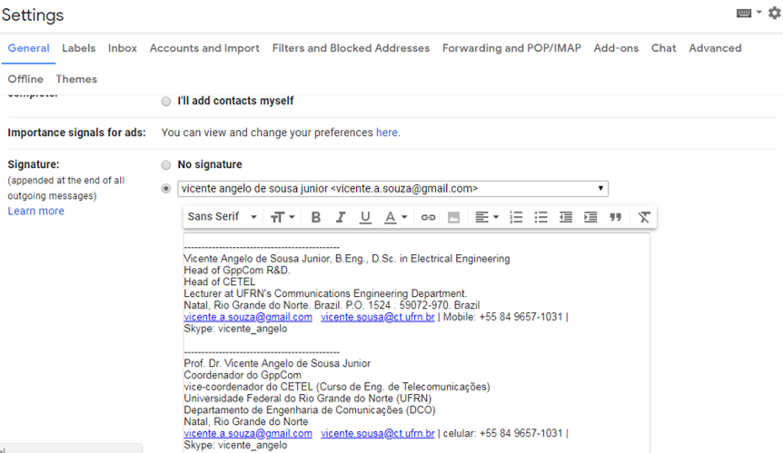

# Treinamento no ns-3 com aspectos complementares aos apresentados no tutorial

### Equipe
 - Idealizador/Orientador: Prof. Vicente Sousa (vicente.sousa@ufrn.edu.br)
 - Coordenador: MSc. Daniel Luna (daniel.luna.088@ufrn.edu.br)
 - Equipe técnica: Daniel Luna (daniel.luna.088@ufrn.edu.br), Tarciana Guerra (tarcianabrito@ufrn.edu.br), Daniel Flor (danielflor@ufrn.edu.br), Jéssika Cristina (jessie@ufrn.edu.br), Ravan Oliveira (ravan@ufrn.edu.br), Malco Dantas (malco@ufrn.edu.br), Lucas Ismael (lucasismael.gppcom@ufrn.edu.br), Ricardo Queiroz (ricardo.queiroz.105@ufrn.edu.br) e Dário Macedo (dario.macedo.129@ufrn.edu.br)

Última Atualização: 13/09/2021


### Recomendações gerais do GppCom

- No seu e-mail principal Criar uma assinatura do e-mail no padrão do GppCom, como no exemplo a seguir:

```
---------------------------------------------
Lucas Ismael Campos Medeiros
Graduando em Engenharia de Telecomunicações
Universidade Federal do Rio Grande do Norte (UFRN)
Natal, Rio Grande do Norte
Email: lucasismael.gppcom@ufrn.edu.br | lucasismaelcm@gmail.com
Tel: (84) 9 9669-2432
```

Fazer automaticamente no gmail de acordo com a figura a seguir:



- Comunicação corporativa
   - Mandar e-mail para lista quando o assunto for de interesse de todos: labsim-ufrn@googlegroups.com
   - Usar Whatsapp para notícias rápidas e compartilhamento de material técnico/oportunidades de cunho geral. E.g., avisar que mandou e-mail importante 
   - Grupos do Whatsapp
      - Grupo geral LabSim/GppCom: com todos os ex-bolsistas
      - Grupo vinculado a linha de pesquisa somente com o prof. Vicente e os participantes do grupo
   - **Evitar se comunicar (whatsapp, e-mail) somente com o prof. Vicente ou com um membro da equipe (TODOS DA EQUIPE ESPECIFICA PRECISAM SER COPIADOS EM TODAS AS MENSAGENS. Até as mensagens bobas!!!!)** 

- Criar conta do github com seu e-mail ```ufrn.edu.br```;
- Direcionar (forward) os e-mails da sua conta ```ufrn.edu.br``` para o seu e-mail principal do Gmail, caso já não seja o ```ufrn.edu.br```.


## Fase 00: Preparação do ambiente de trabalho

### [Hands-on 00: Tutorial de Instalação e configuração da máquina virtual UBUNTU 18.04](http://nbviewer.jupyter.org/github/vicentesousa/ns3-intermediate-training/blob/icTraining/Basic/fase_00/HD_00/h00_VM_18.04.ipynb)
**Objetivos**
- Se habituar Linux, com Github, com jupyter notebook, com ns-3 e com o Eclipse
- Instalar VMWare no Windows;
- Baixar e criar máquina virtual Ubuntu 18.04 no Windows.


### [Hands-on 01: Github - o básico sobre repositórios](http://nbviewer.jupyter.org/github/vicentesousa/ns3-intermediate-training/blob/icTraining/Basic/fase_00/HD_01/f00_hd01.ipynb)
**Objetivos**
- Cadastramento no GitHub;
- Criar repositorios no GitHub;
- Submeter arquivos para repositórios do GitHub;
- Editar o README.md.

### [Hands-on 02: Básico do Jupyter Notebook](http://nbviewer.jupyter.org/github/vicentesousa/ns3-intermediate-training/blob/icTraining/Basic/fase_00/HD_02/f00_hd02.ipynb)
**Objetivos**
- Baixar, abrir, editar e criar Notebooks que executem blocos de código de Python (Python 3);
- Converter notebooks do Jupyter para PDF.

### [Hands-on 03: Instalando o ns-3 e integrando com o Eclipse](http://nbviewer.jupyter.org/github/vicentesousa/ns3-intermediate-training/blob/icTraining/Basic/fase_00/HD_03/f00_hd03.ipynb)
**Objetivos**
- Instalar o ns-3 e dependências;
- Integrar o ns-3 com o eclipse.


## Fase I: Desafios relacionados ao tutorial

### Atividade 1: ler os capítulos 1, 2, 4 e 5 do tutorial do ns-3
- **Material Principal:** an introduction into downloading, setting up, and using builtin models [Tutorial ns-3](https://www.nsnam.org/docs/release/3.33/tutorial/ns-3-tutorial.pdf)
- **Material Complementar:**  documentation on individual protocol and device models that build on the ns-3 core [Model Library do ns-3](https://www.nsnam.org/docs/release/3.33/models/ns-3-model-library.pdf)
- **Material Complementar:** an in-depth coverage of the architecture and core of ns-3 [Manual do ns-3](https://www.nsnam.org/docs/release/3.33/manual/ns-3-manual.pdf)
- Todo esse material pode ser encontrado em [https://www.nsnam.org/releases/ns-3-33/documentation/](https://www.nsnam.org/releases/ns-3-33/documentation/)

### Atividade 2: entender o exemplo first.cc e acompanhar a leitura no [Tutorial ns-3](https://www.nsnam.org/docs/release/3.33/tutorial/ns-3-tutorial.pdf);

#### [Hands-on 01: Desafios relacionados ao exemplo first.cc](http://nbviewer.jupyter.org/github/vicentesousa/ns3-intermediate-training/blob/icTraining/Basic/fase_01/HD_01/f01_hd01.ipynb)
**Objetivos**
- Prática 01: envio de dois pacotes de tamanhos diferentes;
- Prática 02: mudança na taxa de transmissão.

**Equipe de execução:** Ravan Oliveira (ravan@ufrn.edu.br) e Malco Dantas (malco@ufrn.edu.br) - **Prazo:** 02/05/2019;

**Equipe de revisão:** Daniel Luna (danielro@ufrn.edu.br) e Prof. Vicente Sousa (vicente.sousa@ufrn.edu.br) - **Prazo:** 06/05/2019.

### Atividade 3: ler capítulo 6 do [Tutorial ns-3](https://www.nsnam.org/docs/release/3.33/tutorial/ns-3-tutorial.pdf).

### Atividade 4: fazer e entender o exemplo second.cc e acompanhar a leitura no [Tutorial ns-3](https://www.nsnam.org/docs/release/3.33/tutorial/ns-3-tutorial.pdf).

#### [Hands-on 02: Desafios relacionados ao exemplo second.cc](http://nbviewer.jupyter.org/github/vicentesousa/ns3-intermediate-training/blob/icTraining/Basic/fase_01/HD_02/f01_hd02.ipynb)
**Objetivos**
- Prática 01: envio de dois pacotes de tamanhos diferentes sem criar novos objetos;
- Prática 02: aumentar número de nós via linha de comando;
- Prática 03: uso do tcpdump para insperção de arquivos pcap. 

**Equipe de execução:** Lucas Ismael (lucasismael.gppcom@ufrn.edu.br) e Mateus Batista (mateus.gppcom@ufrn.edu.br). - **Prazo:** 02/05/2019;

**Equipe de revisão:** Daniel Luna (danielro@ufrn.edu.br) e Prof. Vicente Sousa (vicente.sousa@ufrn.edu.br) - **Prazo:** 06/05/2019.

### Atividade 5: fazer e entender o exemplo third.cc e acompanhar a leitura no [Tutorial ns-3](https://www.nsnam.org/docs/release/3.33/tutorial/ns-3-tutorial.pdf).

#### [Hands-on 03: Desafios relacionados ao exemplo third.cc](http://nbviewer.jupyter.org/github/vicentesousa/ns3-intermediate-training/blob/icTraining/Basic/fase_01/HD_03/f01_hd03.ipynb)
**Objetivos**
- Prática 01: envio de três pacotes de STAs diferentes;
- Prática 02: uso do NetAnim para verificar o movimento dos usuários.

**Equipe de execução:** Jéssika Cristina (jessie@ufrn.edu.br) - **Prazo:** 02/05/2019;

**Equipe de revisão:** Daniel Luna (danielro@ufrn.edu.br) e Prof. Vicente Sousa (vicente.sousa@ufrn.edu.br) - **Prazo:** 06/05/2019.

### Atividade 6: ler capítulo 7 do [Tutorial ns-3](https://www.nsnam.org/docs/release/3.33/tutorial/ns-3-tutorial.pdf).

#### [Hands-on 04: Desafios relacionados ao exemplo third.cc parte 2](http://nbviewer.jupyter.org/github/vicentesousa/ns3-intermediate-training/blob/icTraining/Basic/fase_01/HD_04/f01_hd04.ipynb)
**Objetivos**
- Prática 01: Mudar modelo de mobilidade, plotar as posições das STAs com o GNUPlot.

**Equipe de execução:** Daniel Luna (danielro@ufrn.edu.br) - **Prazo:** 08/05/2019;

**Equipe de revisão:** Jéssika Cristina (jessie@ufrn.edu.br) - **Prazo:** 12/05/2019.


#### [Hands-on 05: Desafios relacionados ao exemplo fifth.cc](https://nbviewer.jupyter.org/github/vicentesousa/ns3-intermediate-training/blob/icTraining/Basic/fase_01/HD_05/f01_hd05.ipynb)
**Objetivos**
- Prática 01: uso do GNUPlot para visualizar a janela de congestionamento.

**Equipe de execução:** Daniel Flor (danielflor@ufrn.edu.br) - **Prazo:** 02/05/2019;

**Equipe de revisão:** Daniel Luna (danielro@ufrn.edu.br) e Prof. Vicente Sousa (vicente.sousa@ufrn.edu.br) - **Prazo:** 06/05/2019.

### Atividade 7: ler capítulo 8 do [Tutorial ns-3](https://www.nsnam.org/docs/release/3.33/tutorial/ns-3-tutorial.pdf).

#### [Hands-on 06: Uso dos exemplos sixth.cc e seventh.cc](https://nbviewer.jupyter.org/github/vicentesousa/ns3-intermediate-training/blob/icTraining/Basic/fase_01/HD_06/f01_hd06.ipynb)
**Objetivos**
- Descrever os exemplos sixth.cc e seventh.cc;
- Gerar o gráfico do seventh.cc.

**Equipe de execução:** Ricardo Queiroz (ricardo.queiroz.105@ufrn.edu.br) e Dário Macedo (dario.macedo.129@ufrn.edu.br);

**Equipe de revisão:** Daniel Luna (danielro@ufrn.edu.br) e Tarciana Guerra (tarcianabrito@ufrn.edu.br).

#### [Hands-on 07: Uso do exemplo rate-adaptation-distance.cc](https://nbviewer.jupyter.org/github/vicentesousa/ns3-intermediate-training/blob/icTraining/Basic/fase_01/HD_07/f01_hd07.ipynb)
**Objetivos**
- Descrever o exemplo rate-adaptation-distance.cc;
- Gerar o gráfico Throughput vs. Distância para os valores padrões do script.

**Equipe de execução:** Jéssika (jessie@ufrn.edu.br);

**Equipe de revisão:** Daniel Luna (danielro@ufrn.edu.br) e Prof. Vicente Sousa (vicente.sousa@ufrn.edu.br).

<!---
comentário
-->
## Para continuar com as campanhas de investigação de desempenho do Wi-Fi: 

- ### [Treinamento Wi-Fi](https://github.com/vicentesousa/ns3-intermediate-training/tree/icTraining/Wi-Fi) 

## Para continuar com as campanhas de investigação de desempenho do LTE: 

- ### [Treinamento LTE](https://github.com/vicentesousa/ns3-intermediate-training/tree/icTraining/LTE) 

## Ferramentas Complementares

Série de Hands-on que descrevem as ferramentas, problemas e soluções encontrados ao longo do desenvolvimento do treinamento ns-3-intermediate-training.


### [Hands-on 1: FlowMonitor, campanhas e plotagem de gráficos](https://nbviewer.jupyter.org/github/vicentesousa/ns3-intermediate-training/blob/icTraining/ferramentas_complementares/HD_01/fc_hd01.ipynb)
**Objetivos**
 - Usar o FlowMonitor no ns-3;
 - Campanhas de Simulação;
 - Plotagem de Gráficos usando o Matlab (Licença Educacional LabSim/DCO - UFRN).

**Instruções para o hands-on**
 - Descrever a inserção do FlowMonitor em um script do ns-3 (pode ser do Wi-Fi).
 - Criação das campanhas de simulação (um *.sh*) por meio de um script do Matlab (Licença Educacional LabSim/DCO - UFRN);
 - Simular os diversos cenários, variando os parâmetros necessários para um número definido de Jobs;
 - Plotar os gráficos utilizando o Matlab (Licença Educacional LabSim/DCO - UFRN).

 - **Equipe de execução:** Daniel Luna (danielro@ufrn.edu.br).

 **Equipe de revisão:** Daniel Flor (danielflor@ufrn.edu.br) e Jéssika Cristina (jessie@ufrn.edu.br) - **Última Atualização:** 07/2019.


### [Hands-on 2: Uso do Núcleo de Processamento de Alto Desempenho - NPAD (UFRN)](https://nbviewer.jupyter.org/github/vicentesousa/ns3-intermediate-training/blob/icTraining/ferramentas_complementares/HD_02/fc_hd02.ipynb)

**Objetivos**
 - Simulando no supercomputador (NPAD) da UFRN.
 
**Instruções para o hands-on**
 - Básico de instalação do ns-3 indo até o “hello simulator”;
 - Listagem de problemas/soluções já enfrentados;
 - Boas práticas.

 - **Equipe de execução:** Todo o time contribuirá para o desenvolvimento deste hands-on. **Prazo:** 17/09/2019.
 
 
 - **Equipe de revisão:** Daniel Luna (danielro@ufrn.edu.br) - **Última Atualização:** 09/2019.
 
### [Hands-on 3: Criação e uso de *patch* para distribuição de código modificado](https://nbviewer.jupyter.org/github/vicentesousa/ns3-intermediate-training/blob/icTraining/ferramentas_complementares/HD_03/fc_hd03.ipynb)

**Objetivos**
 - Criação e uso da ferramenta de alteração/atualização *patch*.
 
**Instruções para o hands-on**
 - A definir

 - **Equipe de execução:** A definir.
 
  - **Equipe de revisão:** Daniel Luna (danielro@ufrn.edu.br)- **Prazo:** -/-/-.
